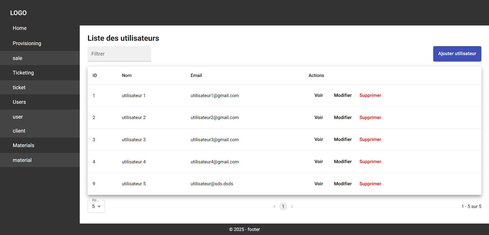
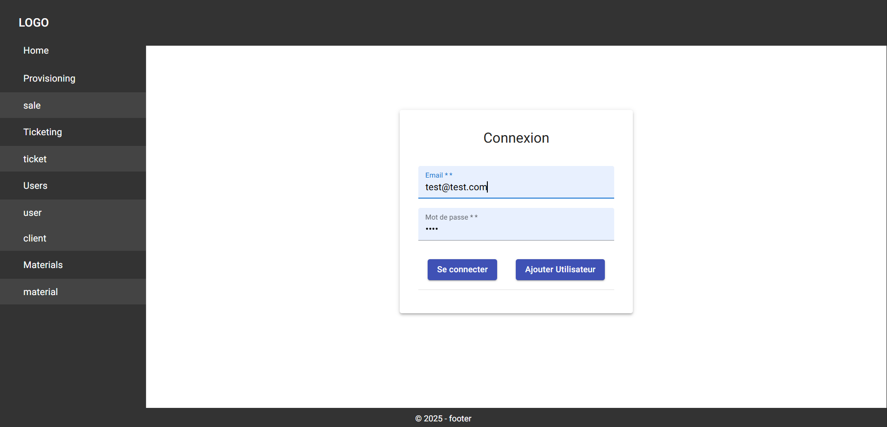
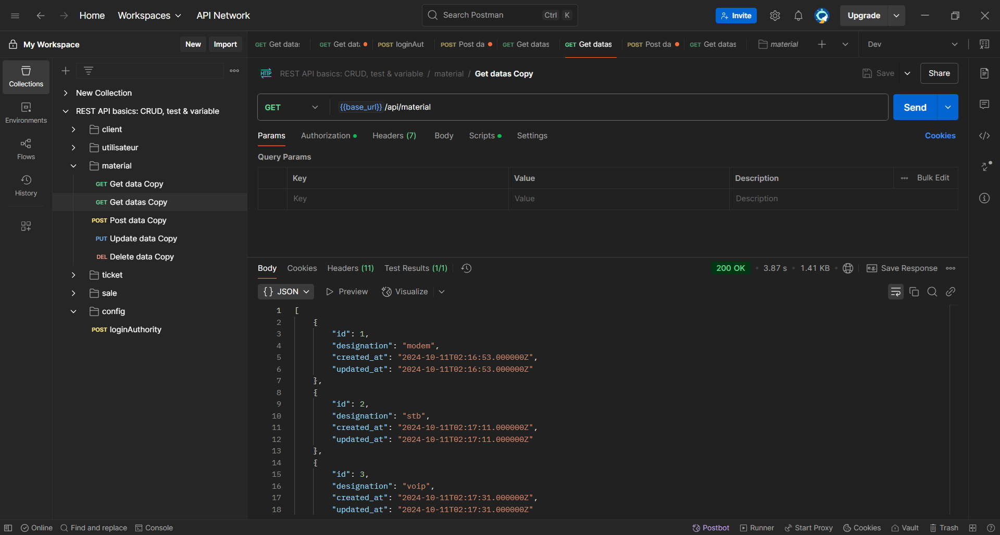

# CRUD Docker Symfony React

Simple CRUD with API Symfony 6.4, front-end React 19, MySQL and phpMyAdmin under Docker.

## Prerequisite
- Docker
- Docker Compose

## Install

- Build of the project :
```bash  
git clone https://github.com/ghyslain12/symfony-docker-apache-react.git 
sudo chmod -R 777 symfony-docker-apache-react/
cd symfony-docker-apache-react
docker-compose up --build -d
docker exec -it symfony_app sh -c "composer install"
```  


## Docker usage

- Mount container :
```bash  
docker-compose up
```  
- Unmount container :
```bash  
docker-compose down
```  

## Features
- Back-end: Symfony Api JWT
- Front-end: React & JWT login / signup
- Testing
- NelmioApiDocBundle (Swagger)
- Docker Apache Mysql

## Services
- React (front-end): http://localhost:4200
- Symfony (API): http://localhost:8741/api


## API [utilisateur, client, material, ticket, sale...]

Api NelmioApiDocBundle: http://localhost:8741/api/doc

### Create a user
  **`/utilisateur`** Add a new user in the system.

### List all users
  **`/utilisateur`** Get the list of all users.

### Get a user
  **`/utilisateur/{id}`** Get the detail of a user by his id.

### Update a user
  **`/utilisateur/{id}`** Update the informations of a existing user.

### Delete a user
  **`/utilisateur/{id}`** Delete a specific user by his id.


## JWT

### Get a token
  **`/login`** Authenticate a user and returns a token.

- Enable (.env): JWT_ENABLE=true
- Disable (.env): JWT_ENABLE=false

## Preview








